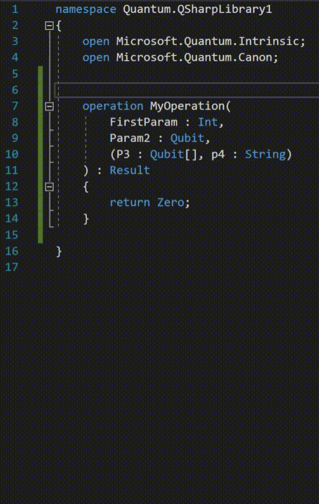
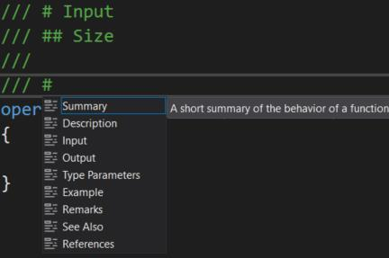

# QSharpTripleSlash
QSharpTripleSlash is a Visual Studio extension that autogenerates documentation comments for Q# code.
It was inspired by [cpptripleslash](https://github.com/tcbhat/cpptripleslash), which brought C#-style
documentation completion and Intellisense support in Visual Studio to C++. This extension is a spiritual
successor meant for Q# developers.

## Features
Q# code is documented with [comment blocks that start with three forward-slashes](https://docs.microsoft.com/en-us/quantum/language/statements?view=qsharp-preview#documentation-comments).

This can be tedious to write out by hand, especially for operations and functions that have a large 
number of parameters. QSharpTripleSlash does this for you, by automatically creating the comment skeleton
for you as soon as you type three forward-slashes above an operation, function, or newtype definition:

It will automatically add an `# Input` section if your method has input parameters, and a subsection for each one.
It will also add an `# Output` section if your method returns something besides `UnitType`.

Pressing `Enter` on a line within a documentation comment will automatically add a new line that has 
three forward slashes and is properly indented, making it easy to write multiline comments.

Finally, QSharpTripleSlash comes with simple support for Markdown section autocomplete suggestions:

These section suggestions (and their tooltip descriptions) are all derived from Q#'s official documentation.

## Installation
The extension will soon be available on the Visual Studio Marketplace, and as a standalone VSIX file in the
releases section of the repository. Stay tuned!

### Prerequisites
- [Visual Studio](https://visualstudio.microsoft.com/downloads/) 2017 or 2019
- The [.NET Core runtime](https://dotnet.microsoft.com/download)
- The [Quantum Development Kit](https://marketplace.visualstudio.com/items?itemName=quantum.DevKit)

## Configuration
Some of the extension's behavior is determined by an included TOML configuration file. This currently includes:
- Logging level
- Number of lines in-between Markdown sections
- Number of lines in-between parameter subsections

The config file contains documentation that explains each of the modifiable settings and their options.
More may be added based on demand.

## Building from Source
This project is set up as a Visual Studio 2019 solution, so you will need that to compile it.

Prerequisites:
- [Visual Studio 2019](https://visualstudio.microsoft.com/downloads/)
- [Visual Studio SDK](https://docs.microsoft.com/en-us/visualstudio/extensibility/visual-studio-sdk?view=vs-2019)
- [.NET Core SDK](https://dotnet.microsoft.com/download)

There are also several NuGet dependencies including [Protobuf](https://www.nuget.org/packages/Google.Protobuf/),
the [Q# Compiler](https://www.nuget.org/packages/Microsoft.Quantum.Compiler/), [Nlog](https://www.nuget.org/packages/NLog/),
and [Nett](https://www.nuget.org/packages/Nett/). These dependencies will all be acquired automatically during 
the build process.

### Structure
QSharpTripleSlash is built as two separate components. The first is the Visual Studio extension itself, which is called
`QSharpTripleSlash.Extension`. This component takes care of autocomplete support and text processing.

The second is a small standalone .NET Core application that runs in the background, called `QSharpTripleSlash.Parser`.
It is somewhat similar to a language server and provides Q# parsing support. This application uses the Q# compiler
and text processor from NuGet to extract parameter and return type metadata from Q# operation and function signatures.

There is a third library, called `QsharpTripleSlash.Common`, that defines common elements that both components share
(including logging and message passing code).

### Build Steps
The Visual Studio extension relies on the parsing wrapper application to be built and published, prior to building itself.
Follow these steps to successfully compile the extension:
1. Build the `QSharpTripleSlash.Parser` project in Release mode.
2. Publish the project to the target folder `bin\Release\netcoreapp2.1\publish\`.
3. Unload the `QSharpTripleSlash.Extension` project and reload it. It should now include a `Parser` folder with links
    to all of the files that were just published for the parser.
4. Build the extension project, and you're done.

# License
Copyright (C) 2019 [The MITRE Corporation](https://www.mitre.org).

Licensed under the Apache License, Version 2.0 (the "License");
you may not use this file except in compliance with the License.
You may obtain a copy of the License at

    http://www.apache.org/licenses/LICENSE-2.0

Unless required by applicable law or agreed to in writing, software
distributed under the License is distributed on an "AS IS" BASIS,
WITHOUT WARRANTIES OR CONDITIONS OF ANY KIND, either express or implied.
See the License for the specific language governing permissions and
limitations under the License.

This project contains content developed by The MITRE Corporation.
If this code is used in a deployment or embedded within another project,
it is requested that you send an email to [opensource@mitre.org](mailto:opensource@mitre.org) in order
to let us know where this software is being used.